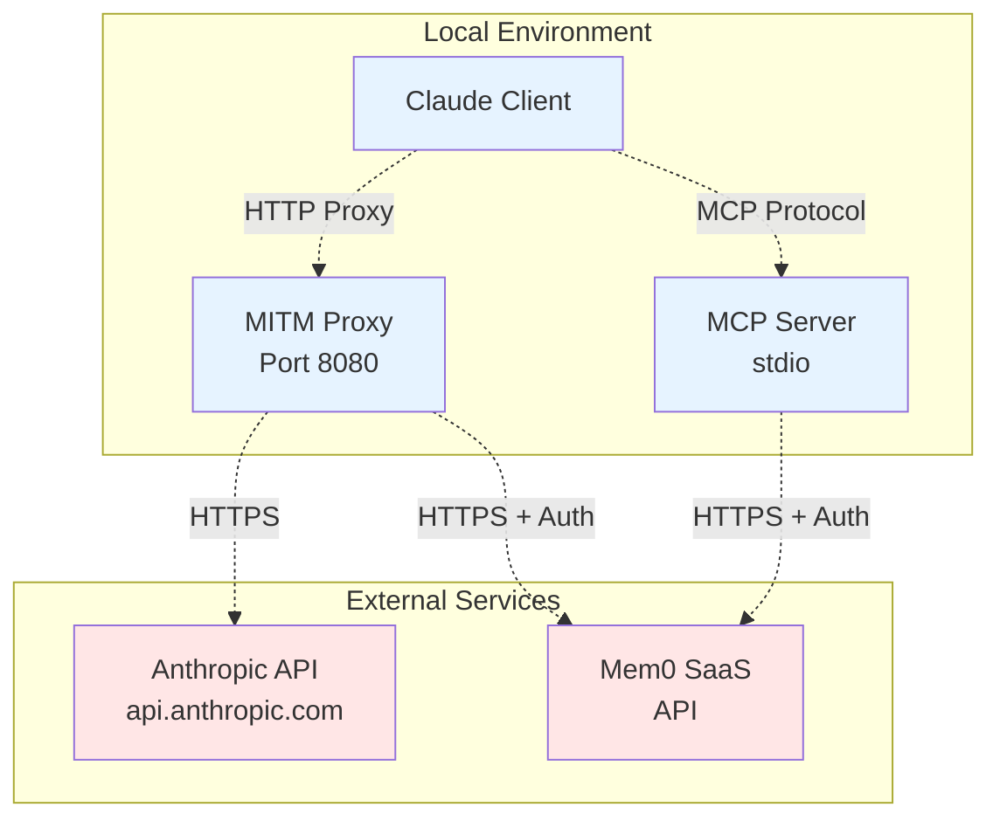

# Deployment Guide

**Last Updated:** 2024-12-19

## Overview

This guide covers deploying and running the MCP MITM Mem0 system for production use. The system consists of two main components that work together to provide memory capabilities for Claude.

## Architecture Overview



## Prerequisites

### System Requirements

- **Operating System**: Linux, macOS, or Windows
- **Python**: 3.12 or higher
- **Memory**: 512MB RAM minimum
- **Storage**: 100MB free space
- **Network**: Internet connectivity for Mem0 API access

### Required Accounts

- **Mem0 SaaS Account**: Sign up at [https://app.mem0.ai](https://app.mem0.ai)
- **API Key**: Generate API key from Mem0 dashboard

## Installation

### 1. Clone Repository

```bash
git clone https://github.com/terrymunro/mcp-mitm-mem0.git
cd mcp-mitm-mem0
```

### 2. Install Dependencies

```bash
# Install uv package manager if not already installed
curl -LsSf https://astral.sh/uv/install.sh | sh

# Install project dependencies
uv sync
```

### 3. Configuration

Create environment configuration:

```bash
# Create .env file
cat > .env << 'EOF'
# Required: Mem0 API Key
MEM0_API_KEY=your_mem0_api_key_here

# Optional: Configuration
DEBUG=false
DEFAULT_USER_ID=your_username
MITM_HOST=localhost
MITM_PORT=8080
MCP_NAME=mcp-mitm-mem0
EOF

# Secure the file
chmod 600 .env
```

### 4. Certificate Installation

Install MITM proxy certificates for HTTPS interception:

```bash
# Generate certificates
mitmdump --version  # This creates ~/.mitmproxy/ directory

# Install CA certificate (macOS)
sudo security add-trusted-cert -d -r trustRoot -k /Library/Keychains/System.keychain ~/.mitmproxy/mitmproxy-ca-cert.pem

# Install CA certificate (Linux)
sudo cp ~/.mitmproxy/mitmproxy-ca-cert.pem /usr/local/share/ca-certificates/mitmproxy-ca-cert.crt
sudo update-ca-certificates

# Install CA certificate (Windows)
# Use certlm.msc to import ~/.mitmproxy/mitmproxy-ca-cert.pem to Trusted Root Certification Authorities
```

## Component Deployment

### MITM Proxy Server

The MITM proxy intercepts Claude API calls and stores conversations:

```bash
# Basic deployment
uv run mitmdump -s memory_addon.py

# Production deployment with logging
uv run mitmdump -s memory_addon.py \
    --listen-host 127.0.0.1 \
    --listen-port 8080 \
    --set confdir=~/.mitmproxy \
    > mitm.log 2>&1 &

# Store process ID for management
echo $! > mitm.pid
```

## Service Management

### MITM Proxy Service

The MITM proxy can be run as a system service since it's a standalone network proxy:

#### Systemd Service (Linux)

```bash
sudo tee /etc/systemd/system/mcp-mitm-proxy.service << 'EOF'
[Unit]
Description=MCP MITM Proxy Service
After=network.target
Requires=network.target

[Service]
Type=simple
User=yourusername
WorkingDirectory=/path/to/mcp-mitm-mem0
Environment=PATH=/path/to/mcp-mitm-mem0/.venv/bin:/usr/bin:/bin
EnvironmentFile=/path/to/mcp-mitm-mem0/.env
ExecStart=/path/to/mcp-mitm-mem0/.venv/bin/mitmdump -s memory_addon.py --listen-host 127.0.0.1 --listen-port 8080
Restart=always
RestartSec=5

[Install]
WantedBy=multi-user.target
EOF

# Enable and start the proxy service
sudo systemctl daemon-reload
sudo systemctl enable mcp-mitm-proxy.service
sudo systemctl start mcp-mitm-proxy.service
sudo systemctl status mcp-mitm-proxy.service
```

#### LaunchAgent (macOS)

```bash
# Create LaunchAgent directory
mkdir -p ~/Library/LaunchAgents

# MITM Proxy LaunchAgent
tee ~/Library/LaunchAgents/com.mcp.mitm.proxy.plist << 'EOF'
<?xml version="1.0" encoding="UTF-8"?>
<!DOCTYPE plist PUBLIC "-//Apple//DTD PLIST 1.0//EN" "http://www.apple.com/DTDs/PropertyList-1.0.dtd">
<plist version="1.0">
<dict>
    <key>Label</key>
    <string>com.mcp.mitm.proxy</string>
    <key>ProgramArguments</key>
    <array>
        <string>/path/to/mcp-mitm-mem0/.venv/bin/mitmdump</string>
        <string>-s</string>
        <string>memory_addon.py</string>
        <string>--listen-host</string>
        <string>127.0.0.1</string>
        <string>--listen-port</string>
        <string>8080</string>
    </array>
    <key>WorkingDirectory</key>
    <string>/path/to/mcp-mitm-mem0</string>
    <key>EnvironmentVariables</key>
    <dict>
        <key>MEM0_API_KEY</key>
        <string>your_api_key_here</string>
    </dict>
    <key>RunAtLoad</key>
    <true/>
    <key>KeepAlive</key>
    <true/>
</dict>
</plist>
EOF

# Load LaunchAgent
launchctl load ~/Library/LaunchAgents/com.mcp.mitm.proxy.plist
```

## MCP Client Configuration

**Important**: MCP servers are launched by MCP clients (not as standalone services). Configure your MCP client to launch the memory server:

### Cursor Configuration

Add to your Cursor settings in `.cursor/mcp.json`:

```json
{
  "mcpServers": {
    "mcp-mitm-mem0": {
      "command": "uv",
      "args": ["run", "mcp-mitm-mem0"],
      "cwd": "/absolute/path/to/mcp-mitm-mem0",
      "env": {
        "MEM0_API_KEY": "your_mem0_api_key_here",
        "DEFAULT_USER_ID": "your_username"
      }
    }
  }
}
```

### Claude Desktop Configuration

Add to Claude Desktop's MCP settings file:

**macOS**: `~/Library/Application Support/Claude/claude_desktop_config.json`
**Windows**: `%APPDATA%\Claude\claude_desktop_config.json`
**Linux**: `~/.config/claude/claude_desktop_config.json`

```json
{
  "mcpServers": {
    "mcp-mitm-mem0": {
      "command": "uv",
      "args": ["run", "mcp-mitm-mem0"],
      "cwd": "/absolute/path/to/mcp-mitm-mem0",
      "env": {
        "MEM0_API_KEY": "your_mem0_api_key_here",
        "DEFAULT_USER_ID": "your_username"
      }
    }
  }
}
```

### Alternative: Direct Python Execution

If you prefer not to use `uv`:

```json
{
  "mcpServers": {
    "mcp-mitm-mem0": {
      "command": "python",
      "args": ["-m", "mcp_mitm_mem0.mcp_server"],
      "cwd": "/absolute/path/to/mcp-mitm-mem0",
      "env": {
        "MEM0_API_KEY": "your_mem0_api_key_here",
        "DEFAULT_USER_ID": "your_username",
        "PYTHONPATH": "/absolute/path/to/mcp-mitm-mem0"
      }
    }
  }
}
```

### Proxy Configuration for Claude Clients

Configure your Claude client to use the MITM proxy for API calls:

1. **Environment Variables**:
   ```bash
   export http_proxy=http://127.0.0.1:8080
   export https_proxy=http://127.0.0.1:8080
   ```

2. **System Proxy Settings**:
   - **macOS**: System Settings → Network → Advanced → Proxies
   - **Windows**: Settings → Network & Internet → Proxy  
   - **Linux**: Network settings or browser proxy configuration

   Set HTTP/HTTPS proxy to `http://127.0.0.1:8080`


## Monitoring and Logging

### Log Configuration

Configure structured logging for operational monitoring:

```python
# In memory_addon.py logging configuration
structlog.configure(
    processors=[
        structlog.stdlib.filter_by_level,
        structlog.stdlib.add_logger_name,
        structlog.stdlib.add_log_level,
        structlog.stdlib.PositionalArgumentsFormatter(),
        structlog.processors.TimeStamper(fmt="iso"),
        structlog.processors.JSONRenderer(),
    ],
    logger_factory=structlog.stdlib.LoggerFactory(),
    cache_logger_on_first_use=True,
)
```

### Log Rotation

Configure log rotation to prevent disk space issues:

```bash
# Install logrotate configuration
sudo tee /etc/logrotate.d/mcp-mitm-mem0 << 'EOF'
/path/to/mcp-mitm-mem0/*.log {
    daily
    rotate 7
    compress
    delaycompress
    missingok
    notifempty
    copytruncate
}
EOF
```

### Health Monitoring

Create health check scripts:

```bash
#!/bin/bash
# health_check.sh

# Check MITM proxy
if ! curl -s --connect-timeout 5 --proxy http://127.0.0.1:8080 http://httpbin.org/ip > /dev/null; then
    echo "MITM proxy health check failed"
    exit 1
fi

# Check Mem0 API connectivity
if ! python -c "
import os
from mem0 import MemoryClient
client = MemoryClient(api_key=os.getenv('MEM0_API_KEY'))
client.search('test', user_id='health_check')
"; then
    echo "Mem0 API connectivity check failed"
    exit 1
fi

echo "All health checks passed"
```

## Backup and Recovery

### Memory Backup

Since all memories are stored in Mem0 SaaS, backup strategies depend on Mem0's capabilities:

```python
#!/usr/bin/env python3
# backup_memories.py
import asyncio
import json
from datetime import datetime
from mcp_mitm_mem0.memory_service import memory_service

async def backup_memories(user_id: str, output_file: str):
    """Backup all memories for a user."""
    memories = await memory_service.get_all_memories(user_id=user_id)
    
    backup_data = {
        "timestamp": datetime.now().isoformat(),
        "user_id": user_id,
        "memories": memories
    }
    
    with open(output_file, 'w') as f:
        json.dump(backup_data, f, indent=2)
    
    print(f"Backed up {len(memories)} memories to {output_file}")

# Usage
asyncio.run(backup_memories("your_user_id", "backup.json"))
```

### Configuration Backup

Backup configuration and certificates:

```bash
#!/bin/bash
# backup_config.sh

BACKUP_DIR="backup_$(date +%Y%m%d_%H%M%S)"
mkdir -p "$BACKUP_DIR"

# Backup configuration
cp .env "$BACKUP_DIR/"
cp -r ~/.mitmproxy "$BACKUP_DIR/mitmproxy_certs"

# Backup service configurations
if [ -f /etc/systemd/system/mcp-mitm-proxy.service ]; then
    cp /etc/systemd/system/mcp-mitm-proxy.service "$BACKUP_DIR/"
fi

echo "Configuration backed up to $BACKUP_DIR"
```

## Troubleshooting

### Common Issues

1. **Certificate Not Trusted**:
   ```bash
   # Verify certificate installation
   security find-certificate -c "mitmproxy" -p /System/Library/Keychains/SystemRootCertificates.keychain
   
   # Reinstall if needed
   sudo security delete-certificate -c "mitmproxy" /Library/Keychains/System.keychain
   sudo security add-trusted-cert -d -r trustRoot -k /Library/Keychains/System.keychain ~/.mitmproxy/mitmproxy-ca-cert.pem
   ```

2. **Mem0 API Authentication Failed**:
   ```bash
   # Test API key
   curl -H "Authorization: Bearer $MEM0_API_KEY" https://api.mem0.ai/v1/memories
   
   # Check environment variable
   echo $MEM0_API_KEY
   ```

3. **Proxy Connection Refused**:
   ```bash
   # Check if proxy is running
   netstat -an | grep :8080
   
   # Check proxy logs
   tail -f mitm.log
   ```

### Performance Tuning

```bash
# Increase file descriptor limits
ulimit -n 65536

# Python-specific optimizations
export PYTHONUNBUFFERED=1
export PYTHONDONTWRITEBYTECODE=1

# Memory optimization for large conversation histories
export PYTHONMALLOC=pymalloc
```

## Security Hardening

### File Permissions

```bash
# Secure configuration files
chmod 600 .env
chmod 700 ~/.mitmproxy

# Restrict service user permissions
sudo useradd -r -s /bin/false mcp-service
sudo chown -R mcp-service:mcp-service /path/to/mcp-mitm-mem0
```

### Network Security

```bash
# Firewall configuration (UFW)
sudo ufw enable
sudo ufw allow out 443/tcp  # HTTPS to external APIs
sudo ufw deny in 8080/tcp   # Block external proxy access
```

### Process Isolation

```bash
# Run with restricted privileges
systemctl edit mcp-mitm-proxy.service

# Add override configuration
[Service]
NoNewPrivileges=yes
PrivateTmp=yes
ProtectSystem=strict
ProtectHome=yes
```

## Maintenance

### Regular Maintenance Tasks

1. **Update Dependencies**:
   ```bash
   uv sync --upgrade
   ```

2. **Rotate Certificates**:
   ```bash
   rm -rf ~/.mitmproxy
   mitmdump --version  # Regenerate certificates
   # Reinstall CA certificate
   ```

3. **Monitor Disk Usage**:
   ```bash
   du -sh ~/.mitmproxy/
   du -sh /var/log/mcp-mitm-mem0/
   ```

4. **Check Service Status**:
   ```bash
   systemctl status mcp-mitm-proxy.service
   ```

### Upgrade Procedure

```bash
# 1. Backup current installation
./backup_config.sh

# 2. Stop proxy service
sudo systemctl stop mcp-mitm-proxy.service

# 3. Update code
git pull origin main
uv sync

# 4. Update configuration if needed
# Review .env.example for new settings

# 5. Restart proxy service
sudo systemctl start mcp-mitm-proxy.service

# 6. Restart MCP clients to reload the MCP server
# The MCP server will be automatically restarted by your MCP client

# 7. Verify operation
./health_check.sh
``` 