# MCP MITM Mem0 - Developer Onboarding Guide

**Last Updated:** 2024-12-19

## Welcome to MCP MITM Mem0! 🎉

This guide will help you get started as a developer on the MCP MITM Mem0 project - a simplified memory service for Claude that intercepts conversations via MITM proxy.

> **⚠️ Note**: This project is experimental and deprecated. A new version is being developed at [mcp-claude-memories](https://github.com/terrymunro/mcp-claude-memories).

## Prerequisites

### Required Tools

- **Python 3.12+** (check with `python --version`)
- **uv** package manager (install from [uv docs](https://docs.astral.sh/uv/))
- **Git** for version control
- **mitmproxy** for traffic interception
- **Code Editor**: Cursor, VS Code, or similar with Python support

### Account Requirements

- **GitHub account** with repository access
- **Mem0 SaaS account** - Sign up at [https://app.mem0.ai](https://app.mem0.ai)

## Quick Start

### Setup Flow

```mermaid
flowchart TD
    A[Clone Repository] --> B[Install Dependencies]
    B --> C[Environment Setup]
    C --> D[Get Mem0 API Key]
    D --> E[Run Tests]
    E --> F[Start MITM Proxy]
    F --> G[Start MCP Server]
    G --> H[Verify Setup]
    
    B --> B1{Dependencies OK?}
    B1 -->|No| B2[Check Python 3.12+]
    B2 --> B
    B1 -->|Yes| C
    
    D --> D1{API Key Valid?}
    D1 -->|No| D2[Check Mem0 Account]
    D2 --> D
    D1 -->|Yes| E
    
    E --> E1{Tests Pass?}
    E1 -->|No| E2[Fix Issues]
    E2 --> E
    E1 -->|Yes| F
    
    H --> I[Ready to Develop! 🎉]
```



### 1. Repository Setup

```bash
# Clone the repository
git clone https://github.com/terrymunro/mcp-mitm-mem0.git
cd mcp-mitm-mem0

# Install dependencies with uv
uv sync
```

### 2. Environment Configuration

```bash
# Copy environment template (if it exists)
cp .env.example .env

# Or create a new .env file
cat > .env << 'EOF'
MEM0_API_KEY=your_mem0_api_key_here
DEBUG=true
DEFAULT_USER_ID=dev_user
EOF
```

### 3. Get Mem0 API Key

1. Visit [https://app.mem0.ai](https://app.mem0.ai)
2. Sign up for an account
3. Navigate to API Keys section
4. Generate a new API key
5. Add it to your `.env` file as `MEM0_API_KEY`

### 4. Verification

```bash
# Run tests to verify setup
uv run pytest

# Start MITM proxy (in one terminal)
uv run mitmdump -s memory_addon.py

# Start MCP server (in another terminal)
uv run mcp-mitm-mem0
```

## Development Workflow

### Workflow Diagram

```mermaid
gitgraph
    commit id: "Initial"
    branch develop
    checkout develop
    commit id: "Setup"
    
    branch feature/memory-search
    checkout feature/memory-search
    commit id: "Add search"
    commit id: "Add tests"
    
    checkout develop
    merge feature/memory-search
    commit id: "Feature merged"
    
    checkout main
    merge develop
    commit id: "Release"
```

### Branch Management

- `main` - Production-ready code
- `develop` - Integration branch for features
- `feature/*` - Feature development branches
- `hotfix/*` - Critical bug fixes

### Code Standards

- Follow **PEP 8** Python style guidelines
- Use **ruff** for linting and formatting: `uv run ruff check` and `uv run ruff format`
- Use **async/await** patterns for I/O operations
- Write **type hints** for all functions
- Add **docstrings** for public APIs
- Write **tests** for new functionality

### Commit Guidelines

Follow conventional commit format:

```
type(scope): description

Examples:
feat(mcp): add memory search tool
fix(mitm): resolve SSE parsing issue
docs(readme): update installation instructions
test(memory): add integration tests
```

## Project Structure

```
mcp-mitm-mem0/
├── docs/                          # Project documentation
├── mcp_mitm_mem0/                 # Main package
│   ├── __init__.py
│   ├── config.py                  # Configuration management
│   ├── mcp_server.py             # MCP protocol server
│   ├── memory_service.py         # Mem0 integration
│   └── reflection_agent.py       # Conversation analysis
├── tests/                         # Test suite
│   ├── test_mcp_server.py
│   ├── test_memory_service.py
│   └── test_integration.py
├── memory_addon.py               # MITM proxy addon
├── pyproject.toml               # Project dependencies
├── ruff_defaults.toml           # Linting configuration
└── README.md                    # Project overview
```

### Key Directories

- `mcp_mitm_mem0/` - Core application modules
- `tests/` - Comprehensive test suite
- `docs/` - Architecture and onboarding documentation
- `.cursor/` - Cursor IDE configuration and templates

## Development Environment

### Local Development

1. **MITM Proxy Development**:
   ```bash
   # Run with debug logging
   DEBUG=true uv run mitmdump -s memory_addon.py
   ```

2. **MCP Server Development**:
   ```bash
   # Run with debug output
   DEBUG=true uv run mcp-mitm-mem0
   ```

3. **Certificate Installation**:
   ```bash
   # Install mitmproxy certificates (required for HTTPS)
   mitmdump
   # Follow prompts to install certificates
   ```

### Testing

```bash
# Run all tests
uv run pytest

# Run specific test file
uv run pytest tests/test_memory_service.py

# Run with coverage
uv run pytest --cov=mcp_mitm_mem0

# Run integration tests only
uv run pytest tests/test_integration.py -v
```

### Debugging

- **MITM Proxy**: Use `DEBUG=true` environment variable for detailed logging
- **Memory Service**: Monitor API calls to Mem0 in logs
- **MCP Server**: Use structured logging to trace tool calls
- **Async Operations**: Use `asyncio` debugging tools for async issues

## Architecture Overview

The system has three main components that work together:

1. **MITM Addon**: Intercepts Claude API traffic and extracts conversations
2. **Memory Service**: Handles all Mem0 SaaS interactions for memory storage
3. **MCP Server**: Provides Claude with memory access tools

### Key Components

- **memory_addon.py**: Traffic interception and conversation extraction
- **memory_service.py**: Mem0 API integration and memory operations
- **mcp_server.py**: MCP protocol implementation and tool definitions
- **reflection_agent.py**: Conversation pattern analysis
- **config.py**: Environment-based configuration management

### Data Flow

1. Claude client → MITM Proxy → Anthropic API
2. MITM Proxy → Memory Service → Mem0 SaaS
3. Claude (via MCP) → MCP Server → Memory Service → Mem0 SaaS

## API Documentation

### MCP Tools Available

- `search_memories(query, user_id?, limit?)` - Search memories with natural language
- `list_memories(user_id?)` - List all memories for a user
- `add_memory(messages, user_id?, metadata?)` - Manually add memories
- `delete_memory(memory_id)` - Delete specific memory
- `analyze_conversations(user_id?, limit?)` - Analyze conversation patterns
- `suggest_next_actions(user_id?)` - Get suggestions based on history

### Configuration Options

All configuration via environment variables:

- `MEM0_API_KEY` - Mem0 SaaS API key (required)
- `DEBUG` - Enable debug logging (default: false)
- `DEFAULT_USER_ID` - Default user for memories (default: "default_user")
- `MITM_HOST` - Proxy host (default: "localhost")
- `MITM_PORT` - Proxy port (default: 8080)

## Common Development Tasks

### Adding New MCP Tools

1. Define tool in `mcp_server.py`
2. Implement handler function
3. Add integration with Memory Service
4. Write tests in `tests/test_mcp_server.py`
5. Update documentation

### Debugging Memory Issues

1. Check Mem0 API key validity
2. Monitor memory service logs
3. Verify conversation parsing in MITM addon
4. Test memory operations in isolation

### Testing MITM Interception

1. Configure Claude client to use proxy
2. Monitor MITM logs for intercepted traffic
3. Verify conversation extraction
4. Check memory storage in Mem0

## Getting Help

- **Issues**: Report bugs on GitHub Issues
- **Documentation**: Check `docs/` directory
- **Architecture**: See `docs/architecture.md`
- **Testing**: Run `uv run pytest -v` for detailed output

Happy coding! 🚀 