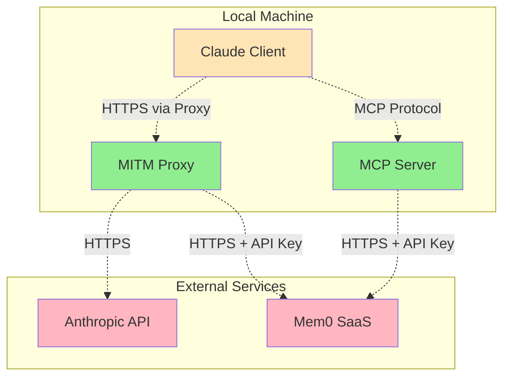

# Security Guide

**Last Updated:** 2024-12-19

## Overview

This document outlines the security considerations, requirements, and best practices for the MCP MITM Mem0 project. As a system that intercepts network traffic and stores conversation data, security is a critical aspect of the architecture.

## Security Architecture

### Trust Boundaries



### Security Zones

- **Green Zone**: MITM Proxy, MCP Server (controlled environment)
- **Yellow Zone**: Claude Client (requires certificate trust)
- **Red Zone**: External APIs (untrusted network)

## Certificate Management

### MITM Proxy Certificates

The MITM proxy requires certificate installation to intercept HTTPS traffic:

1. **Generate Certificates**:
   ```bash
   # Start mitmdump to generate certificates
   mitmdump
   # Certificates are created in ~/.mitmproxy/
   ```

2. **Install CA Certificate**:
   ```bash
   # macOS
   sudo security add-trusted-cert -d -r trustRoot -k /Library/Keychains/System.keychain ~/.mitmproxy/mitmproxy-ca-cert.pem
   
   # Linux
   sudo cp ~/.mitmproxy/mitmproxy-ca-cert.pem /usr/local/share/ca-certificates/mitmproxy-ca-cert.crt
   sudo update-ca-certificates
   
   # Windows
   certlm.msc -> Import to Trusted Root Certification Authorities
   ```

3. **Verify Installation**:
   ```bash
   # Test certificate installation
   curl -v --proxy http://localhost:8080 https://api.anthropic.com/v1/messages
   ```

### Certificate Security

- **CA Private Key**: Store `~/.mitmproxy/mitmproxy-ca-key.pem` securely
- **Certificate Rotation**: Regenerate certificates periodically
- **Scope Limitation**: Only intercept `api.anthropic.com` traffic
- **Cleanup**: Remove certificates when uninstalling

## API Key Management

### Mem0 API Key Security

The Mem0 API key is the primary authentication credential:

1. **Storage**:
   ```bash
   # Store in environment variables
   export MEM0_API_KEY="mem0_key_here"
   
   # Or in .env file (add to .gitignore)
   echo "MEM0_API_KEY=mem0_key_here" >> .env
   ```

2. **Access Control**:
   ```bash
   # Restrict .env file permissions
   chmod 600 .env
   
   # Verify permissions
   ls -la .env
   # Should show: -rw------- 1 user user .env
   ```

3. **Key Rotation**:
   - Rotate API keys regularly in Mem0 dashboard
   - Update environment variables after rotation
   - Monitor for unauthorized usage

### Environment Variable Security

```bash
# Good: Scoped to specific process
MEM0_API_KEY=secret_key uv run mcp-mitm-mem0

# Bad: Global environment variable
export MEM0_API_KEY=secret_key  # Available to all processes
```

## Data Protection

### Data in Transit

All external communications use HTTPS/TLS:

- **Anthropic API**: TLS 1.2+ for all Claude API calls
- **Mem0 SaaS**: TLS 1.2+ for memory operations
- **MCP Protocol**: Local communication (localhost only)

### Data at Rest

- **No Local Storage**: All persistent data stored in Mem0 cloud
- **Temporary Data**: Minimal in-memory conversation data
- **Logging**: Structured logs without sensitive conversation content

### Data Classification

| Type | Classification | Storage | Retention |
|------|----------------|---------|-----------|
| Conversation Content | Sensitive | Mem0 Cloud | Per Mem0 Policy |
| API Keys | Secret | Environment Variables | N/A |
| Metadata | Internal | Mem0 Cloud | Per Mem0 Policy |
| Logs | Internal | Local/Structured | Configurable |

## Network Security

### Proxy Configuration

```bash
# Secure proxy binding (localhost only)
mitmdump -s memory_addon.py --listen-host 127.0.0.1 --listen-port 8080

# Insecure: binding to all interfaces
mitmdump -s memory_addon.py --listen-host 0.0.0.0
```

### Firewall Rules

```bash
# Allow only necessary traffic
ufw allow out 443/tcp  # HTTPS to external APIs
ufw deny in 8080/tcp   # Block external proxy access
```

### Traffic Filtering

The MITM addon only processes specific traffic:

```python
# Only intercept Anthropic API calls
if "api.anthropic.com" not in flow.request.pretty_host:
    return

# Only process specific endpoints
if not flow.request.path.startswith("/v1/messages"):
    return
```

## Authentication & Authorization

### User Isolation

Memories are isolated by `user_id`:

```python
# Memory operations include user_id for isolation
await memory_service.add_memory(
    messages=messages,
    user_id=settings.default_user_id,  # User-specific
    # ...
)
```

### Access Control

- **Local Only**: MCP server only accepts localhost connections
- **No Authentication**: Relies on local system security
- **User Context**: All operations scoped to configured user_id

## Privacy Considerations

### Conversation Storage

- **Cloud Storage**: All conversations stored in Mem0 SaaS
- **User Consent**: Users must understand data is being captured
- **Data Sovereignty**: Subject to Mem0's data location policies

### Data Minimization

```python
# Only store necessary conversation data
messages = [{
    "role": "user",
    "content": user_content,  # Minimal content extraction
}, {
    "role": "assistant", 
    "content": assistant_content,
}]
```

### Sensitive Data Handling

- **PII Detection**: No built-in PII scrubbing (user responsibility)
- **Logging**: Avoid logging conversation content
- **Debug Mode**: Disable in production to prevent data leakage

## Threat Model

### Threats and Mitigations

| Threat | Impact | Likelihood | Mitigation |
|--------|---------|------------|------------|
| API Key Compromise | High | Medium | Environment variables, key rotation |
| Certificate Compromise | Medium | Low | Regular certificate regeneration |
| MITM Detection | Low | Medium | Proper certificate installation |
| Data Interception | High | Low | HTTPS/TLS for all external traffic |
| Local Privilege Escalation | Medium | Low | Run with minimal privileges |

### Attack Vectors

1. **Stolen API Keys**: Access to Mem0 account and stored memories
2. **Compromised Certificates**: Ability to intercept other HTTPS traffic
3. **Local Access**: Reading environment variables or memory
4. **Network Interception**: MITM attacks on external API calls

## Security Checklist

### Installation Security

- [ ] Install CA certificate only for specific user
- [ ] Verify certificate installation scope
- [ ] Set restrictive file permissions on .env
- [ ] Confirm API key validity and scope
- [ ] Test proxy configuration with localhost binding

### Operational Security

- [ ] Monitor Mem0 API usage for anomalies
- [ ] Rotate API keys regularly
- [ ] Update certificates periodically
- [ ] Review stored conversation data
- [ ] Monitor proxy logs for unusual activity

### Incident Response

1. **API Key Compromise**:
   ```bash
   # Immediately revoke compromised key in Mem0 dashboard
   # Generate new API key
   # Update environment variables
   # Monitor for unauthorized usage
   ```

2. **Certificate Compromise**:
   ```bash
   # Remove compromised certificates
   # Regenerate new certificates
   # Reinstall CA certificate
   # Verify installation
   ```

## Compliance Considerations

### Data Retention

- **Mem0 Policy**: Follow Mem0's data retention policies
- **User Rights**: Support data deletion requests
- **Audit Trail**: Maintain logs of memory operations

### Regulatory Requirements

- **GDPR**: Right to be forgotten, data portability
- **CCPA**: California Consumer Privacy Act compliance
- **HIPAA**: Healthcare data requires additional protections

## Security Monitoring

### Logging

```python
# Security-relevant events
logger.info("Memory operation", user_id=user_id, operation="search")
logger.warning("API key validation failed", error=str(e))
logger.error("Certificate installation failed", cert_path=cert_path)
```

### Alerting

Monitor for:

- Failed API authentication attempts
- Unusual memory access patterns  
- Certificate validation failures
- Proxy connection anomalies

## Best Practices

### Development

- Use separate API keys for development and production
- Never commit API keys to version control
- Use mock services for testing when possible
- Regular security testing of MITM configuration

### Deployment

- Run with minimal system privileges
- Use dedicated user account for service
- Configure firewall rules appropriately
- Monitor system and application logs

### Maintenance

- Keep dependencies updated for security patches
- Regular certificate rotation
- API key rotation schedule
- Security configuration review 
